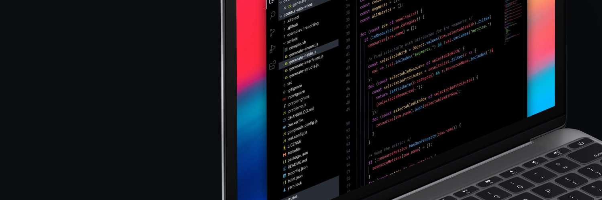

<h1 align="center">Google Ads Go</h1>



<h4 align="center">
  Unofficial Google Ads API client library for Golang
</h4>

<p align="center">
  <a href="https://opteo.com">
    
  </a>
</p>

# Features

- Faster than the official client libraries
- Uses [gRPC](https://grpc.io/) and [Protocol Buffers](https://developers.google.com/protocol-buffers/) internally (recommended by Google)
- Provides all API functionality

# Installation

```bash
$ go get -d github.com/opteo/google-ads-go
```

# Documentation

_coming soon_

# Usage

_work in progress_

```go
package main

import (
    "fmt"

    "github.com/opteo/google-ads-go/gads"
    "github.com/opteo/google-ads-go/services"
)

func main() {
  // Create a client from credentials file
  client, err := ads.NewClientFromStorage("google-ads.json")
  if err != nil {
    panic(err)
  }

  // Load the "GoogleAds" service
  googleAdsService := services.NewGoogleAdsServiceClient(client.Conn())

  // Create a search request
  request := services.SearchGoogleAdsRequest{
    CustomerId: "2984242032",
    Query:      "SELECT campaign.id, campaign.name FROM campaign ORDER BY campaign.id",
  }

  // Get the results
  response, err := googleAdsService.Search(client.Context(), &request)
  for _, row := range response.Results {
    campaign := row.Campaign
    fmt.Printf("id: %d, name: %s\n", campaign.Id.Value, campaign.Name.Value)
  }
}
```
